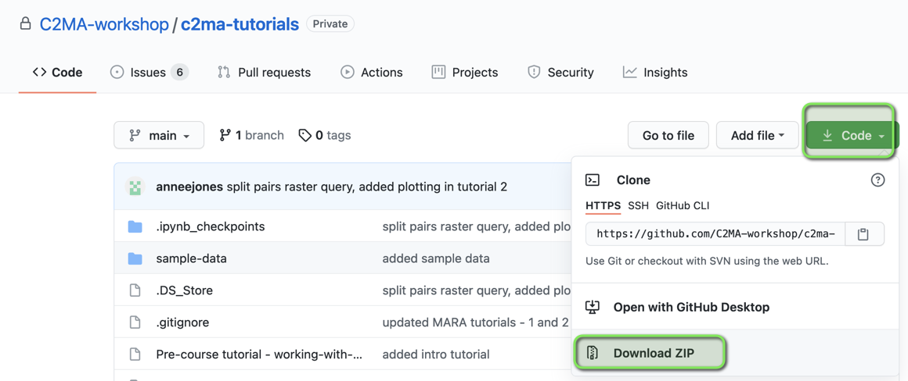

# Climate change and malaria workshop - tutorials
Various tutorials demonstrating how to query climate from IBM PAIRS/Weather Ops Center api, post-process, and calculate simple malaria transmission metrics

# Using IBM PAIRS
There are two modes for using PAIRS, Graphical User Interface (GUI) and via API calls. There are "Datasets" and "DataLayers". There is a one to many relationship (a dataset contains one or more datalayers).   

The tutorials in this repository will show you how to use the python api. The PAIRS GUI can also be used for querying and for exploring the Datasets and Datalayers available to you. If you have followed the setup steps ([https://github.com/C2MA-workshop/c2ma-docs](https://github.com/C2MA-workshop/c2ma-docs)) you should already have PAIRS access via an IBM id and an api key.

## PAIRS GUI
We recommend quickly going through the videos (they are each very short) to become familiar with the interface and then go to the step by step instructions while also looking at the online tutorial :  

There are a few short videos https://www.youtube.com/playlist?list=PL0VD16H1q5IO3sP-i667TVyn4OsSP6kPc.  
Online PAIRS GUI Tutorial https://pairs.res.ibm.com/tutorial/tutorials/gui/index.html.  
Access PAIRS GUI here: https://ibmpairs.mybluemix.net/ (log in with your IBM id).  

We will run a short demo of the GUI in the workshop.

## Tutorial - fetch Notebooks to your local machine

To get a copy of the Notebooks follow the steps below.

Create a sub-directory of your choice on your own machine and then click on Code -> Download ZIP and save the zip file. Unzip the zip file to be able to access all the files from this github.

The Notebooks are contained in files ending .jpynb

## Import Notebooks to your Project

If you have followed the setup step ([https://github.com/C2MA-workshop/c2ma-docs](https://github.com/C2MA-workshop/c2ma-docs)) then you will have a Project ready for the Notebooks to be imported into.  

See [Import test Notebook to Watson Studio](https://github.com/C2MA-workshop/c2ma-docs#import-test-notebook-to-watson-studio) to import all the Notebooks in this github into the same Project used in the setup instructions.

